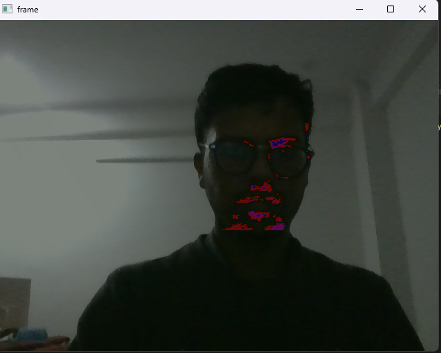

# face_beard_highlight
This project aims to help during beard trimming 
by highlighting beard problem areas that need to be trimmed.

**NOTE:** See how the algorithm works in [this Jupyter Notebook](prototype.ipynb).


## Install & Run

### Installation
Ensure Python 3 is installed, and then run these commands:
```console
$ git clone https://github.com/sohang3112/face_beard_highlight.git
$ cd face_beard_highlight
$ pip install -r requirements.txt   # NOTE: this can take 10-15 mins because of dependency face_recognition
```

### Running
Now start the program with command `python main.py`.


## Tested on:
- Windows 11 - Webcam, Video url
- Fedora 38 (Linux) - Video url
- Docker - Video url


## TODO
- Test webcam on docker


## Bugs
- When `video-url` and output video path are both given, and during execution *Ctrl+C* is pressed to
raise `KeyboardError`, then the output video file `test.avi` is saved corrupted and doesn't play.

For example:
```console
$ python main.py --video-url "https://player.vimeo.com/external/373966277.sd.mp4?s=bc69e79a8007eb5682e9e72a415a2142173228f6&profile_id=164&oauth2_token_id=57447761" --output test.avi
```

- 25th percentile of grayscale frame is steadily increasing in each frame,
so after a point, it increases so much that hear & beard stop being highlighted completely.
Don't know why, since I tested with my face in webcam, sitting stationary, 
with stable (medium) lighting conditions.

- Only beard should be highlighted, but other facial features (eg. hair, spectacles) are also highlighted.

- Modify threshold to account for lighting conditions. 
If it's very dark, almost everything is highlighted. If it's very bright, almost nothing is highlighted.

For example, in this image (medium lighting), 
some beard areas are highlighted while majority is not highlighted:




## Useful Tools & Resources
- Pick exact RGB color from any image pixel: https://www.imgcolorpicker.com/